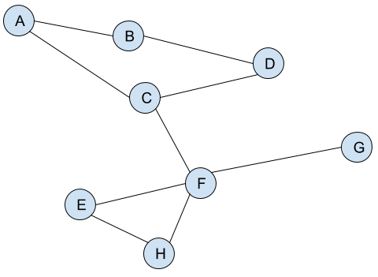

# Shortest Path across the Internet

For a computer network, it's useful to know how to get a packet from one host to
another across the Internet.

For this challenge, you will print out the shortest route from one host to
another on the console.

Even though we're using this to see how packets are routed on a network, the
exact same procedure could be used to:

* find how you're connected to a friend of a friend
* route an AI through a level
* etc.

## Map of the Internet

This is what is in the boilerplate:



## Modified BFS

Take your BFS code and modify it so that each neighbor gets a link back to its
parent:

```pseudocode
BFS(graph, startVert):
  for v of graph.vertices:
    v.parent = null   // <-- Add parent initialization

  startVert.visited = true
  queue.enqueue(startVert)

  while !queue.isEmpty():
    u = queue.dequeue()

    for v of u.neighbors:
      if not v.visited:
        v.visited = true
        v.parent = u     // <-- Keep a parent link
        queue.enqueue(v)
```

## Procedure

1. Perform a BFS from the _ending vert_ (host). This will set up all the
   `parent` pointers across the graph.

2. Output the route by following the parent pointers from the _starting_ vert
   printing the values as you go.


## Sample Run
```
$ python routing.py HostA HostD
HostA --> HostB --> HostD
$ python routing.py HostA HostH
HostA --> HostC --> HostF --> HostH
$ python routing.py HostA HostA
HostA
$ python routing.py HostE HostB
HostE --> HostF --> HostC --> HostA --> HostB
```
